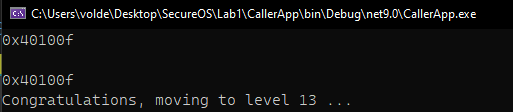
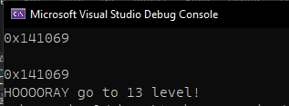

# Отчет по ЛР1

## Задача

Когда происходит вызов main создается кадр стека и наш стек выглядит так:
```
| BUF (80 байт) | EBP (4 байта) | Адрес возврата для EIP (4 байта) |
```

Пользуясь уязвимостью мы хотим перезаписать адрес возврата EIP, 
чтобы после выхода из main - выполнилась инструкция под нашим адресом 
(в данном случае функция unreachable).

Таким образом надо просто передать 84 байта мусора + адресс который затрет собой адрес возврата.

Для того чтобы это сделать я написал [C# приложение](./CallerApp/Program.cs) которое 2 раза вызывает необходимый .exe
1. Сохраняет адрес функции unreachable (считывает строку, обрезает, парсит, переворачивает и приводит к нужному формату).
2. Передает 84 байта мусора + адресс из пункта 1



## Дополнительное задание 1
Благодаря первому считыванию, а не фиксированному адресу я автоматически выполнил задание.

## Дополнительное задание 2
Создал проект в VS добавил туда [.cpp из архива](./CPPApp/CPPApp.cpp) в задании и .h:
```h
#include "stdio.h"
#include "string.h"

void jump_level(int n) {
	printf("HOOOORAY go to %d level!", n);
}
```

При сборке в Properties установил все флаги во вкладке Optimization и все флаги со словом Check в "No".

Запустил программу из основого задания и все отработало штатно.

