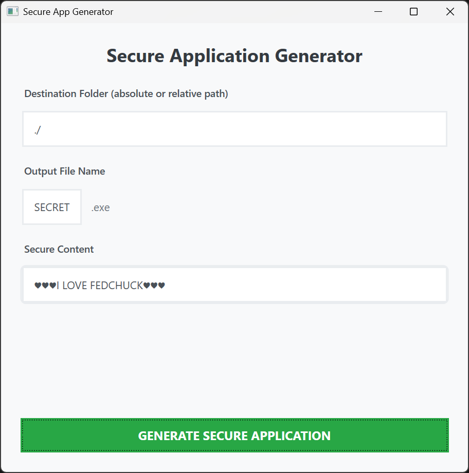
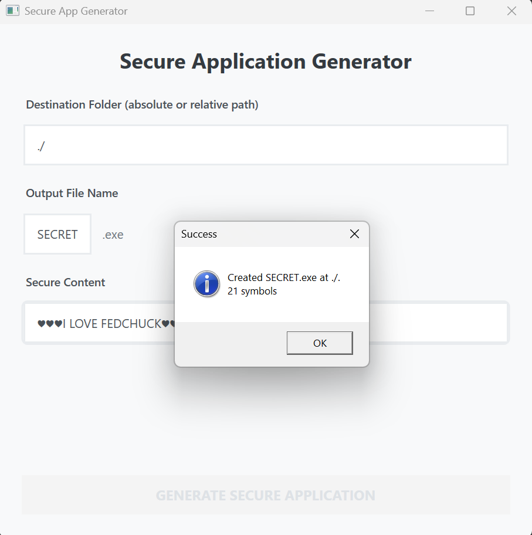
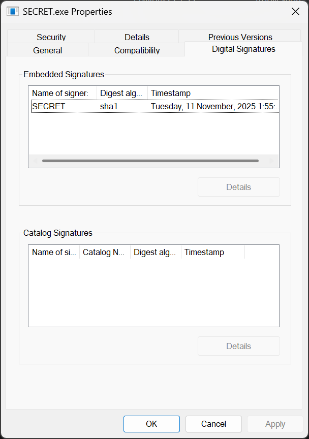
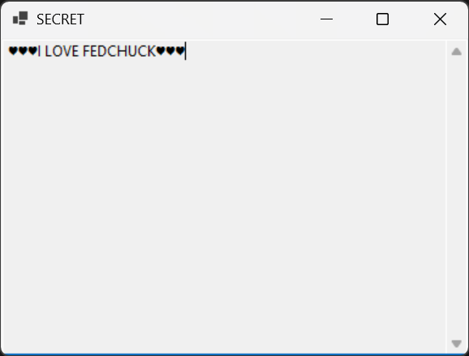

# Отчет по ЛР2

## Сборка

>[!Important]
> Для запуска приложения должен быть установлен [.net sdk](https://dotnet.microsoft.com/en-us/download)

В папке `./Lab2/SecureKeyCreatorApp/` запустите скрипт:

```
dotnet publish -o ./Release -c Release --self-contained true
```

Результат: `./Lab2/SecureKeyCreatorApp/Release/WpfApp.exe`

## Описание работы

При запуске появляется форма:



Заполните конечную папку, название итогового файла и контент который вы хотите скрыть.
Затем нажмите зеленую кнопку (если кнопка не зеленая, то перепроверьте заполнение формы).


После того как скрипт отработает - появится окно об успешном выполнении:


Также после успешного выполнения появится файл по указонному пути с указанным именем.
По умолчанию `./Lab2/SecureKeyCreatorApp/Release/SECRET.exe`


Этот файл самоподписан:



И при его открытии появляется окно с нашим секретным текстом:


## Под капотом

Приложение генератор написано на .NET WPF и состоит из:
1. [Разметка](./SecureKeyCreatorApp/WpfApp/MainWindow.xaml)
2. [Код для UI](./SecureKeyCreatorApp/WpfApp/MainWindow.xaml.cs)
3. [Core генератора приложений](./SecureKeyCreatorApp/WpfApp/AppGenerator.cs)

Самое интересное это код генератора приложений:
1. Сначала мы создаем приложение WinForms с секретным текстом и билдим его.
2. Затем при помощи `System.Security.Cryptography` создаем сертефикат и экспортируем его в файл.
3. Ищем `signtool.exe`.
4. И наконец подписываем наше приложение.