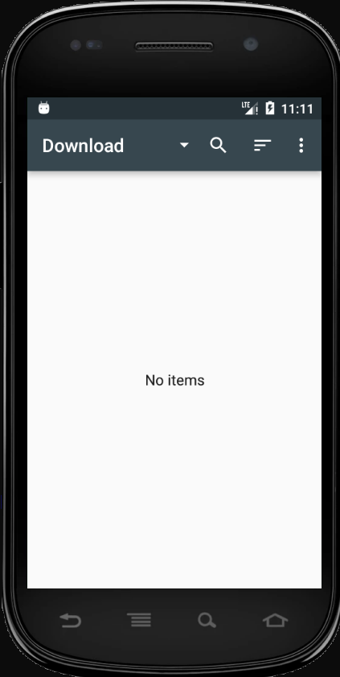
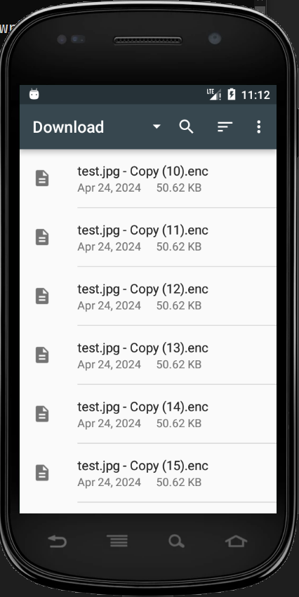

# Отчет по ЛР4

## Описание

Утилита **DecryptorCLI** для расшифровки файлов `.enc` на Android-устройстве через ADB. Приложение позволяет восстановить файлы, зашифрованные вредоносным ПО (ransomware).

## Сборка

> [!Important]
> Для запуска приложения должен быть установлен [.NET SDK 9.0](https://dotnet.microsoft.com/en-us/download) и [Android Platform Tools (ADB)](https://developer.android.com/tools/releases/platform-tools)

В папке `./Lab4/DecryptorCLI/App/` запустите скрипт:

```sh
dotnet publish -o ./Release -c Release -r win-x64 --self-contained true
```

Результат: `./Lab4/DecryptorCLI/App/Release/App.exe`

## Использование

```sh
> App.exe
DecryptorCLI - A utility to decrypt .enc files on an Android device via ADB

Usage:
  dotnet run -- [options]

Options:
  --backup <dir>      Local directory to save pulled and decrypted files
                      (default: .\backup)

  --push              Push decrypted files back to the device
                      If a file already exists, a .recovered suffix is added

  --delete            Delete original .enc files from the device after successful decryption
                      Requires confirmation (or use --yes to skip)

  --yes               Automatically confirm deletion of .enc files (no prompt)

  --cleanup           Delete local 'pulled' and 'recovered' folders after completion
                      Useful when using --push to avoid leaving files on PC

  --password <p>      Password for decryption (SHA256 -> AES-256-CBC key)
                      (default: jndlasf074hr)

  --sdroot <path>     Root directory to search for .enc files on the device
                      (default: /sdcard/)

  --device <serial>   Device serial number (if multiple devices are connected)
                      Get serial numbers with: adb devices

  --help, -h          Show this help message

Examples:
  dotnet run -- --backup ./output
  dotnet run -- --backup ./output --push --delete --yes
  dotnet run -- --push --cleanup --yes
  dotnet run -- --password mySecret123 --sdroot /storage/emulated/0
```

## Пример работы

### 1. Загрузка зашифрованных файлов на устройство (эмуляция атаки)

```sh
> adb -e push C:\Users\volde\Downloads\test /sdcard/Download
push: C:\Users\volde\Downloads\test/test.jpg.enc -> /sdcard/Download/test.jpg.enc
push: C:\Users\volde\Downloads\test/test.jpg - Copy.enc -> /sdcard/Download/test.jpg - Copy.enc
push: C:\Users\volde\Downloads\test/test.jpg - Copy (9).enc -> /sdcard/Download/test.jpg - Copy (9).enc
push: C:\Users\volde\Downloads\test/test.jpg - Copy (8).enc -> /sdcard/Download/test.jpg - Copy (8).enc
push: C:\Users\volde\Downloads\test/test.jpg - Copy (7).enc -> /sdcard/Download/test.jpg - Copy (7).enc
push: C:\Users\volde\Downloads\test/test.jpg - Copy (6).enc -> /sdcard/Download/test.jpg - Copy (6).enc
push: C:\Users\volde\Downloads\test/test.jpg - Copy (5).enc -> /sdcard/Download/test.jpg - Copy (5).enc
push: C:\Users\volde\Downloads\test/test.jpg - Copy (4).enc -> /sdcard/Download/test.jpg - Copy (4).enc
push: C:\Users\volde\Downloads\test/test.jpg - Copy (3).enc -> /sdcard/Download/test.jpg - Copy (3).enc
push: C:\Users\volde\Downloads\test/test.jpg - Copy (23).enc -> /sdcard/Download/test.jpg - Copy (23).enc
push: C:\Users\volde\Downloads\test/test.jpg - Copy (22).enc -> /sdcard/Download/test.jpg - Copy (22).enc
push: C:\Users\volde\Downloads\test/test.jpg - Copy (21).enc -> /sdcard/Download/test.jpg - Copy (21).enc
push: C:\Users\volde\Downloads\test/test.jpg - Copy (20).enc -> /sdcard/Download/test.jpg - Copy (20).enc
push: C:\Users\volde\Downloads\test/test.jpg - Copy (2).enc -> /sdcard/Download/test.jpg - Copy (2).enc
push: C:\Users\volde\Downloads\test/test.jpg - Copy (19).enc -> /sdcard/Download/test.jpg - Copy (19).enc
push: C:\Users\volde\Downloads\test/test.jpg - Copy (18).enc -> /sdcard/Download/test.jpg - Copy (18).enc
push: C:\Users\volde\Downloads\test/test.jpg - Copy (17).enc -> /sdcard/Download/test.jpg - Copy (17).enc
push: C:\Users\volde\Downloads\test/test.jpg - Copy (16).enc -> /sdcard/Download/test.jpg - Copy (16).enc
push: C:\Users\volde\Downloads\test/test.jpg - Copy (15).enc -> /sdcard/Download/test.jpg - Copy (15).enc
push: C:\Users\volde\Downloads\test/test.jpg - Copy (14).enc -> /sdcard/Download/test.jpg - Copy (14).enc
push: C:\Users\volde\Downloads\test/test.jpg - Copy (13).enc -> /sdcard/Download/test.jpg - Copy (13).enc
push: C:\Users\volde\Downloads\test/test.jpg - Copy (12).enc -> /sdcard/Download/test.jpg - Copy (12).enc
push: C:\Users\volde\Downloads\test/test.jpg - Copy (11).enc -> /sdcard/Download/test.jpg - Copy (11).enc
push: C:\Users\volde\Downloads\test/test.jpg - Copy (10).enc -> /sdcard/Download/test.jpg - Copy (10).enc
24 files pushed. 0 files skipped.
2517 KB/s (1244160 bytes in 0.482s)
```

### 2. Запуск дешифратора

```sh
> App.exe --push --yes --delete
Found .enc files: 24
Backup dir: A:\1OWN\uni\SecureOS\Lab4\DecryptorCLI\App\bin\Debug\net9.0\win-x64\backup
Push back: True
Delete .enc: True
Cleanup local: False

[FILE] /sdcard/Download/test.jpg.enc
  OK  -> pushed to: /sdcard/Download/test.jpg

[FILE] /sdcard/Download/test.jpg - Copy.enc
  OK  -> pushed to: /sdcard/Download/test.jpg - Copy

[FILE] /sdcard/Download/test.jpg - Copy (9).enc
  OK  -> pushed to: /sdcard/Download/test.jpg - Copy (9)

[FILE] /sdcard/Download/test.jpg - Copy (8).enc
  OK  -> pushed to: /sdcard/Download/test.jpg - Copy (8)

[FILE] /sdcard/Download/test.jpg - Copy (7).enc
  OK  -> pushed to: /sdcard/Download/test.jpg - Copy (7)

[FILE] /sdcard/Download/test.jpg - Copy (6).enc
  OK  -> pushed to: /sdcard/Download/test.jpg - Copy (6)

[FILE] /sdcard/Download/test.jpg - Copy (5).enc
  OK  -> pushed to: /sdcard/Download/test.jpg - Copy (5)

[FILE] /sdcard/Download/test.jpg - Copy (4).enc
  OK  -> pushed to: /sdcard/Download/test.jpg - Copy (4)

[FILE] /sdcard/Download/test.jpg - Copy (3).enc
  OK  -> pushed to: /sdcard/Download/test.jpg - Copy (3)

[FILE] /sdcard/Download/test.jpg - Copy (23).enc
  OK  -> pushed to: /sdcard/Download/test.jpg - Copy (23)

[FILE] /sdcard/Download/test.jpg - Copy (22).enc
  OK  -> pushed to: /sdcard/Download/test.jpg - Copy (22)

[FILE] /sdcard/Download/test.jpg - Copy (21).enc
  OK  -> pushed to: /sdcard/Download/test.jpg - Copy (21)

[FILE] /sdcard/Download/test.jpg - Copy (20).enc
  OK  -> pushed to: /sdcard/Download/test.jpg - Copy (20)

[FILE] /sdcard/Download/test.jpg - Copy (2).enc
  OK  -> pushed to: /sdcard/Download/test.jpg - Copy (2)

[FILE] /sdcard/Download/test.jpg - Copy (19).enc
  OK  -> pushed to: /sdcard/Download/test.jpg - Copy (19)

[FILE] /sdcard/Download/test.jpg - Copy (18).enc
  OK  -> pushed to: /sdcard/Download/test.jpg - Copy (18)

[FILE] /sdcard/Download/test.jpg - Copy (17).enc
  OK  -> pushed to: /sdcard/Download/test.jpg - Copy (17)

[FILE] /sdcard/Download/test.jpg - Copy (16).enc
  OK  -> pushed to: /sdcard/Download/test.jpg - Copy (16)

[FILE] /sdcard/Download/test.jpg - Copy (15).enc
  OK  -> pushed to: /sdcard/Download/test.jpg - Copy (15)

[FILE] /sdcard/Download/test.jpg - Copy (14).enc
  OK  -> pushed to: /sdcard/Download/test.jpg - Copy (14)

[FILE] /sdcard/Download/test.jpg - Copy (13).enc
  OK  -> pushed to: /sdcard/Download/test.jpg - Copy (13)

[FILE] /sdcard/Download/test.jpg - Copy (12).enc
  OK  -> pushed to: /sdcard/Download/test.jpg - Copy (12)

[FILE] /sdcard/Download/test.jpg - Copy (11).enc
  OK  -> pushed to: /sdcard/Download/test.jpg - Copy (11)

[FILE] /sdcard/Download/test.jpg - Copy (10).enc
  OK  -> pushed to: /sdcard/Download/test.jpg - Copy (10)

Done. ok=24 fail=0 pushed=24 deleted=24
```

## Скриншоты

### До загрузки зашифрованных файлов


### После загрузки зашифрованных файлов


### Расшифрованный


## Под капотом

Приложение написано на .NET 9 и состоит из:
1. [Program.cs](./DecryptorCLI/App/Program.cs) — основной код приложения
2. [App.csproj](./DecryptorCLI/App/App.csproj) — файл проекта

### Алгоритм работы:
1. Подключение к Android-устройству через ADB
2. Поиск всех файлов с расширением `.enc` в указанной директории
3. Скачивание зашифрованных файлов на локальный ПК
4. Расшифровка файлов с использованием AES-256-CBC
5. (опционально) Отправка расшифрованных файлов обратно на устройство
6. (опционально) Удаление зашифрованных файлов

### Детали шифрования:
- **Алгоритм**: AES-256-CBC с PKCS7 padding
- **Ключ**: SHA-256 от пароля (по умолчанию `jndlasf074hr`)
- **IV**: 16 нулевых байт

## Использование ИИ

Для анализа вредоносного приложения и поиска способа шифрования был использован GitHub Copilot.

### Процесс анализа:

1. Декомпилировал DEX-файл вредоносного Android-приложения с помощью ByteViewer
2. Скачал архив с Java-классами
3. Открыл декомпилированный код в VS Code
4. Попросил Copilot проанализировать код:

**Запрос:**
> "Это декомпелированный dex file вирусного андроид приложения. Это приложение шифрует файлы на телефоне и просит ввести код для того чтобы вернуть доступ. Тебе надо найти где и как он шифрует файлы чтобы можно было написать дешифратор и восстановить доступ к данным"

**Ответ Copilot:**

> ### Где и как шифрует
>
> **Точка запуска шифрования:** `MainService.java` → в отдельном потоке создаёт `FilesEncryptor` и вызывает `encrypt()`.
>
> **Обход файлов:** `FilesEncryptor.java`
> - Рекурсивно сканирует `Environment.getExternalStorageDirectory()` (память/SD)
> - Шифрует только расширения из `Constants.EXTENSIONS_TO_ENCRYPT`: jpeg jpg png bmp gif pdf doc docx txt avi mkv 3gp mp4
> - Для каждого файла делает `AesCrypt.encrypt(original, original + ".enc")`, затем удаляет оригинал: `(new File(var2)).delete();`
>
> **Алгоритм шифрования:** `AesCrypt.java`
> - Пароль/ключевая строка зашита: `"jndlasf074hr"` (также в `Constants.CIPHER_PASSWORD`)
> - Ключ AES: `SHA-256(UTF-8(password))`, берутся все 32 байта → AES-256
> - Режим: `AES/CBC/PKCS7Padding`
> - IV: 16 нулевых байт (`new IvParameterSpec(new byte[16])`)
> - Формат файла: без заголовка, просто ciphertext; имя файла меняется добавлением `.enc`
>
> Из этого следует: **"код для разблокировки" не нужен для дешифрации файлов** — ключ фиксированный, IV фиксированный, соли/рандома нет.

На основе этого анализа был написан дешифратор на C#, который использует `System.Security.Cryptography.Aes` для восстановления файлов.
